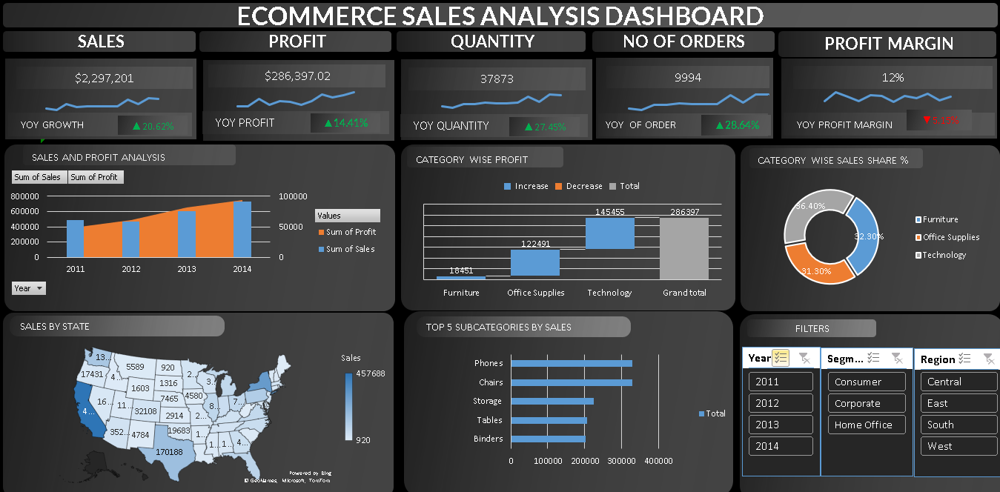

# 📊 E-commerce Sales Analysis Using Excel

This project presents an interactive **E-commerce Sales Analysis Dashboard** created using Microsoft Excel. The dashboard provides detailed insights into sales, profits, order trends, and category-wise performance for an e-commerce business.

---

## 📈 Dashboard Features

- **Total Sales**: $2.3M  
- **Total Profit**: $286K  
- **Total Quantity Sold**: 37,873  
- **Total Orders**: 9,994  
- **Profit Margin**: 12%

### 🚀 Year-over-Year Growth:
- **Sales** ↑ +20.62%
- **Profit** ↑ +14.41%
- **Quantity** ↑ +27.45%
- **Orders** ↑ +28.64%
- **Profit Margin** ↓ -5.15%

---

## 📊 Key Visuals & Insights

- **Sales and Profit Trends** (2011-2014)
- **Category-wise Profit Comparison**
- **Category-wise Sales Share (%)**
- **Sales Distribution by State (Map)**
- **Top 5 Subcategories by Sales**
- **Interactive Filters**: Year, Segment, Region

---

## 🛠️ Tools Used

- Microsoft Excel (Pivot Tables, Pivot Charts, Slicers)
- Data Cleaning & Formatting
- Excel Formulas & KPIs

---

## 📁 Files Included

| File | Description |
|------|-------------|
| `Ecommerce Sales Analysis.xlsx` | The Excel workbook with raw data, KPIs, and dashboard |
| `Dashboard.PNG` | Screenshot of the dashboard |
| `Kpi.PNG` | Visual representation of KPIs |
| `Pivot_table.PNG` | Screenshot of pivot table used |

---

## 📌 Purpose

This dashboard is a part of a data analysis project aimed at helping decision-makers in e-commerce businesses understand key performance metrics at a glance and make data-driven decisions.

